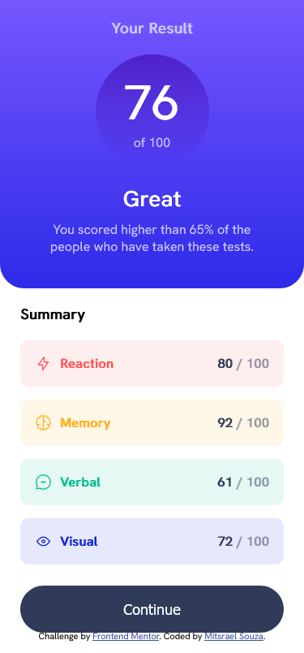

# Frontend Mentor - Results summary component solution

This is a solution to the [Results summary component challenge on Frontend Mentor](https://www.frontendmentor.io/challenges/results-summary-component-CE_K6s0maV). Frontend Mentor challenges help you improve your coding skills by building realistic projects. 

## Table of contents

- [Overview](#overview)
  - [The challenge](#the-challenge)
  - [Screenshot](#screenshot)
  - [Links](#links)
- [My process](#my-process)
  - [Built with](#built-with)
  - [What I learned](#what-i-learned)
  - [Continued development](#continued-development)
  - [Useful resources](#useful-resources)
- [Author](#author)
- [Acknowledgments](#acknowledgments)

## Overview
  This project is an example of an results summary component made with HTML and CSS.

### The challenge

Users should be able to:

- View the optimal layout for the interface depending on their device's screen size
- See hover and focus states for all interactive elements on the page

### Screenshot

# Desktop


# Mobile



### Links

- Solution URL: [GitHub code](https://github.com/M-its/results-summary-component)
- Live Site URL: [Result Summary live page](https://m-its.github.io/results-summary-component/)

## My process

### Built with

- Semantic HTML5 markup
- CSS custom properties
- Flexbox
- Mobile-first workflow

### What I learned

In this project i was able to use media queries and a mobile-first workflow, besides praticing pseudo-elements like this:

```css
button {
    display: inline-block;
    position: relative;
    margin-top: 1rem;

    padding: 18px 32px;

    font-size: 1.8rem;
    color: var(--white);
    font-weight: 700;

    border: none;
    border-radius: 30px;
    background-color: var(--dark-gray-blue);
    backface-visibility: hidden;
    z-index: 1;
}

button:after {
    position: absolute;
    content: '';
    top: 0;
    left: 0;
    width: 100%;
    height: 100%;
    border-radius: 30px;
    background-image: linear-gradient(
        180deg,
        var(--light-slate-blue),
        var(--light-royal-blue)
    );
    transition: opacity 0.3s ease-out;
    z-index: 2;
    opacity: 0;
}

button:hover:after {
    opacity: 1;
}

button span {
    position: relative;
    z-index: 3;
}
```

### Continued development

I still need to pratice pseudo-elements and media queries.

### Useful resources

- [Stackoverflow - Use CSS3 transitions with gradient backgrounds](https://stackoverflow.com/questions/6542212/use-css3-transitions-with-gradient-backgrounds) - This helped me in the implemantation of a transition in a gradient button.

- [W3Schools - CSS Media Queries](https://www.w3schools.com/css/css3_mediaqueries.asp) - This is an amazing article which helped me finally understand how do media querie work.

## Author

-   GitHub - [@M-its](https://github.com/M-its)
-   Frontend Mentor - [@M-its](https://www.frontendmentor.io/profile/M-its)
-   Codepen - [@M-its](https://codepen.io/m-its)

## Acknowledgments

The transition on the gradient button is based on the code provided by [Sascha Lack](https://codepen.io/sashtown/pen/DRyZKw) on codepen.
